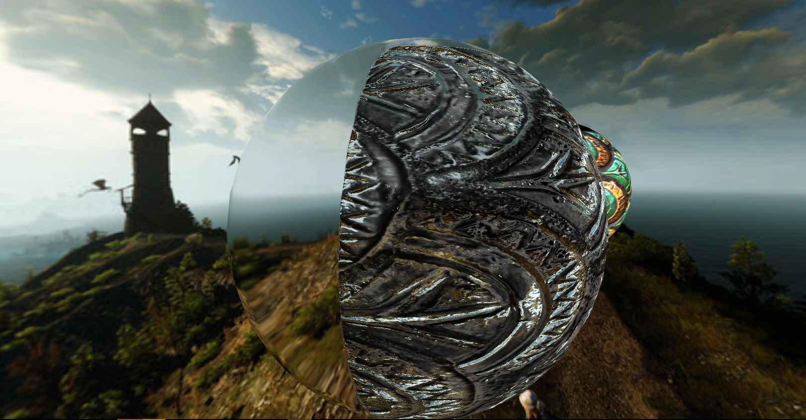

# aframe-refraction-system

 
## Description

The system creates a THREE.cubeCamera, which provides an envMap texture to each registered entity. Uses the THREE.CubeRefractionMapping. The cubeCamera is not attached to the original camera, it just changes position ( explanation in the notes ).
There is need of a existing camera component, i could double check it, but it is easier to keep a `<a-camera>` entity in the scene.

If there are no registered entities, the camera is removed.

Needs to work almost realtime to look good, still, I didn't experience fps-drops.

Check it out [here](https://cdn.rawgit.com/gftruj/aframe-refraction-system/eef3e0ee/example/index.html)  
### Usage
#### script
attach the script  
``

`<a-scene refraction-component="near:1;far:100">`
`<a-entity refraction-component"></a-entity>`
#### npm:
`npm install aframe-refraction-system`

set the camera attributes in the system:  
`<a-scene refraction-component="near:1;far:100">`, 
and the texture tickrate in the component: 
 `<a-entity refraction-component="tickrate:150">`

### Attributes

| Property             | Default      | Description                                         |
|----------------------|--------------|-----------------------------------------------------|
| near         		   |      1       | the near clipping distance                          |
| far                  |      200     | The far clipping distance                           |
| resolution           |      256     | Sets the length of the cubeCamera cube's edges      |
| tickrate  		   |      10      | How often should the texture be updated             |

### Some visual examples
If You don't want to check out my fiddle: 

If the 'far' attribute is low enough, the camera will only catch close objects: 
.png) 

It does not seem to affect my FPS rate : 
.png) 

Looks amazing with normal maps: 
.png) 
### Notes:
 - I do realize that "realtime" is the opposite of "good performance". At least this simple project may be of use to someone willing to expand it

 - I do not attach the cubeCamera to the `<a-camera>`. The cubeCamera scale ( I think its scale, it may be some other issue, making the envMap smaller) gets messed up, so instead of adjusting it I change its position, so the envMap won't look ridiculous. This is a bad idea since its more wasteful then adding one camera to the other, but I'll need to work out the scaling issue.

 I could use the scaling thing to my advantage if I expose it as a variable for people to mess with it.
